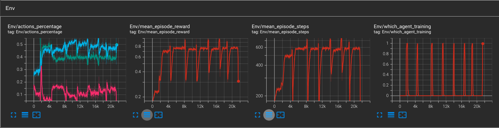
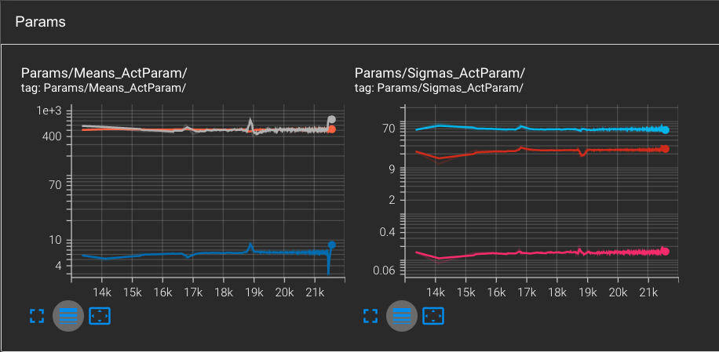

# Reinforcement Learning Platform Environment.

This repository was forked from the original: https://github.com/cycraig/gym-platform/.

The Platform environment uses a parameterised action space and continuous state space. The task involves an agent learning to avoid enemies and traverse across platforms to reach a goal. Three actions are available to the agent: 
- Run(dx)
- Hop(dx)
- leap(dx) 

where dx is a learnable parameter for each discrete action.

A dense reward is given to the agent based on the percentage of distance it travels. A reward of 1 being the highest the agent can get if it reaches the last platform. An episode terminates if the agent touches an enemy or falls into a gap between platforms.

## 1. Installation.

Clone repository and install all dependancies:
```
  git clone https://github.com/thomashustache/platform/
  cd platform
  conda env create --name cycraig --file=env.yml
```

## 2. Arborescence overview

- ```agents``` folder: the different agents used in this project are coded in this directory. ```BaseAgent``` is the parent class of all of them.
- ```api``` folder: some basic conversions between gym env outputs and the agents.
- ```gym_platform``` folder: it contains the implementation of the RL environment we are dealing with.
- ```references```: some papers of interests.
- ```results```: results directory. There will be stores the models' weights, the videos, the frames, the gifs, tensorboard logs etc.
- ```tests```: useful for debugging
- ```trainers```: Different training alogrithm can be used to solve this problem. So far, only the QPAMDP training algorithm has been implemented in this repository.
- ```utils```: some useful functions to record video, gifs, etc.
   
## 3. Algorithm Overview

- To deal with the continuous action space, I chose to implement the **QPAMDP** algorithm which is fully described in the paper [[Masson et al. 2016]](https://arxiv.org/pdf/1509.01644.pdf).
- QPAMDP has two components:
  1. a Q-learning algorithm that will optimize the discrete action choices. I chose the Deep Q-learning algorithm with Experience Replay, whose implementation can be found in the script ```agents/DQNAgent.py```
  2. a Policy Search algorithm that will optimize each discrete action's parameter choices. I chose the Advantage Actor-Critic algorithm, whose implementation ca be found in the script ```agents/A2CAgent.py```
- More precisely, A2C tries to optimize a gaussian distribution for each of the discrete actions' parameter's space, that is to say learning the optimal ***means*** and ***standard deviations*** of each gaussian distribution.
- It is assumed that the actions are not correlated so we can conly consider learning their respective variance (or standard deviations) and forget about their covariances.
  
## 4. Launch a training

- First choose a name of an experience and fill it the ```EXPERIENCE_NAME``` variable from the ```utils/config.py``` file. Every logs will be then saved under this root folder so that it is easy to access them.

For example, I chose ```EXPERIENCE_NAME = "optimized_stds"```.

- You can adjust other hyperparameters at your taste in the ```utils/config.py``` file. For example adjusting the batch size, the learning rates, etc. 
- Note that there is a parameter called 'OPTIMIZED_STDS'. If set to ```TURE```, the A2C will have to learn both Means AND Standard deviations. If False, the A2C will only learn the means parameters, and the standard deviations will be fixed and manually decreased over training steps.
- Then, a training of the QPAMDP algorithm can be launched with the ```python train_qpamdp.py``` command.

## 5. Monitoring training with Tensorboard

- During training, it is possible to monitor different logs, that will help to understand the learning process and also to detect some bugs.
- Please, enter the command: ```tensorboard --logdir results/logs/[EXPERIENCE_NAME]``` where EXPERIENCE_NAME has to be replaced with the one you chose previously. In my case, I entered ```tensorboard --logdir results/logs/optimized_stds```.
- Tensorboard logs analysis:

<p align = "center">

</p>
<p align = "center">
Fig 1 - Environment logs over training steps for the QPAMDP algorithm. From left to right: ratio of action taken (pink is LEAP, green is RUN blue is HOP), Average reward per episode evolution, Average number of steps per episode. The last graph allows to monitor which of the DQN (0) or the A2C (1) agent is currently training.
</p>

<p align = "center">

</p>
<p align = "center">
Fig 2 - Actor-Critic output values evolution. On the left, we can monitor the evolution of the means of each discrete action (first head of the Actor model). On the right, we monitor the evolution of the standard deviation of each action parameter (second head of the Actor model).
</p>

- On the tensorboard web page, one can also monitor the evolution on the different agents' losses.

## 6. Results
At the end of each loop of the QPAMDP alogirthm, I recorded the current policy and saved the video as a gif. Here is the learned policy after one loop and after 2 loops:

<p align = "center">

</p>
<p align = "center">
Gif 1 - Policy learned with the QPAMDP algorithm. Reward = 0.28 at the end of the first loop. The agent learned how to jump from platform 1 to 2 but he did not make the jump from the 2nd to the last platform
</p>

<p align = "center">

</p>
<p align = "center">
Gif 2 - Policy learned with the QPAMDP algorithm. Reward = 1 at the end of the second loop. The agent learned how to make the second jump.
</p>

## 7. Observations and tracks of improvements

- My algorithm is very sensitive to the inital action-parameters choice. If well chosenn
, the algorithm will converge quickly to the optimal solution. On the other hand, if the parameters are set low on purpose, the agent struggles to learn the optimal parameters.

- We can observe the discrete actions that are taken are quite unbalanced. Hence, when DQN is learning, the agent will learned the qvalues from unbalanced batches of data. We could handle this by adding more weigths to rare actions for example.

- Implement a better advantage estimation for the Actor-Critic model. Indeed, I used a simple TD estimatation but one could use the n-step return estimation or even the Generalized Advantage Estimation (GAE) to find a better trade-off between bias and variance.

- Implement the Parametrized Deep Q-learning algortithm [[P-QDN, Jiechao Xiong et Al., 2018]](https://arxiv.org/pdf/1810.06394.pdf) which seems to outperforms the QPAMDP algorithm on several different environments including the platform environment.

- Implement the Multi-Pass DQN algorithm [[MP-DQN, Craig J. Bester and Al., 2019]](https://arxiv.org/pdf/1905.04388.pdf) which solves the *'false gradient problem'* that appears with PQDN algorithm.


