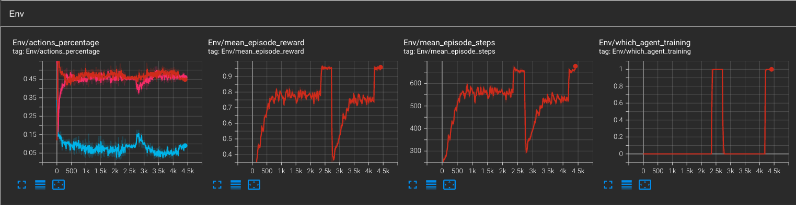
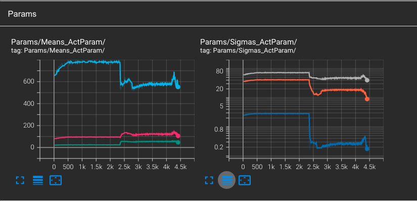

# Reinforcement Learning Platform Environment.

This repository was forked from the original: https://github.com/cycraig/gym-platform/.

## 1. Installation.

First, you will need to clone the entire repository: ```git clone https://github.com/thomashustache/platform/```.

Then, you need to install the conda virtual environment and all of its dependancies from the .yml file:
```conda env create --name cycraig --file=env.yml```

## 2. Algorithm Overview

- To deal with the continuous action space, I chose to implement the **QPAMDP** algorithm which is fully described in the paper [Masson et al. 2016](https://arxiv.org/pdf/1509.01644.pdf).
- QPAMDP has two components:
  1. a Q-learning algorithm that will optimize the discrete action choices. I chose a Deep Q-learning with Experience Replay, whose implementation can be found in the script ```agents/DQNAgent.py```
  2. a Policy Search algorithm that will optimize the continuous parameter choices of each discrete action. I chose the Advantage Actor-Critic algorithm, whose implementation ca be found in the script ```agents/A2CAgent.py```
- More precisely, A2C tries to optimize a gaussian distribution for each of the discrete actions' parameter's space, that is to say learning the optimal ***means*** and ***standard deviations*** of each gaussian distribution.
- It is assumed that the actions are not correlated so we can conly consider learning their respective standard deviations and forget about their covariances.
  
## 3. Launch a training

- First choose a name of an experience and fill it the ```EXPERIENCE_NAME``` inf the ```utils/config.py``` file. Every logs will be then saved under this root folder so that it is easy to access them.

- First choose a name of an experience and fill it the ```EXPERIENCE_NAME``` inf the ```utils/config.py``` file. Every logs will be then saved under this root folder so that it is easy to access them. 

For example, I chose ```EXPERIENCE_NAME = "optimized_stds"```.

- You can adjust other hyperparameters at your taste in the ```utils/config.py``` file. For example adjusting the batch size, the learning rates, etc. 
- Note that there is a parameter called 'OPTIMIZED_STDS'. If true, the A2C will have to learn both Means AND Standard deviations. If False, the A2C will only learn the means parameters, and the standard deviations will be fixed and manually decreased over training steps.
- Then, a training of the QPAMDP algorithm can be launched with the ``` python train_qpamdp.py``` command.

## 4. Monitoring training with Tensorboard

- During training, it is possible to monitor different logs, that will help us understanding the learning process (and also detect some bugs).
- Please, enter the command: ```tensorboard --logdir results/logs/[EXPERIENCE_NAME] ``` where EXPERIENCE_NAME has to be replaced with the one you chose previously.

<p align = "center">

</p>
<p align = "center">
Fig1 - Environment logs over training steps for the QPAMDP algorithm. From left to right: ratio of action taken (blue is LEAP, pink is RUN red is HOP), Average reward per episode evolution, Average number of steps per episode. The last graph allows to monitor which of the DQN (0) or the A2C (1) agent is currently training.
</p>

<p align = "center">

</p>
<p align = "center">
Fig 2 - Actor-Critic output values evolution. On the left, we can monitor the evolution of the means of each discrete action (first head of the Actor model). On the right, we monitor the evolution of the standard deviation of each action parameter (second head of the Actor model).
</p>


## 5. Results
At the end of each loop of the QPAMDP alogirthm, I recorded the current policy and saved the video as a gif. Here is the learned policy after only one loop of training (which consists of several thousands of parameters updates per agent).

<p align = "center">

</p>
<p align = "center">
Gif.1 - Policy learned with the QPAMDP algorithm. Reward = 0.72 at the end of the first loop. The agent learned how to jump from platform 1 to 2 but he did not make the jump from the 2nd to the last platform
</p>

<p align = "center">

</p>
<p align = "center">
Gif.2 - Policy learned with the QPAMDP algorithm. Reward = 1 at the end of the second loop. The agent learned how to make the second jump.
</p>

## 5. Tracks of improvements


